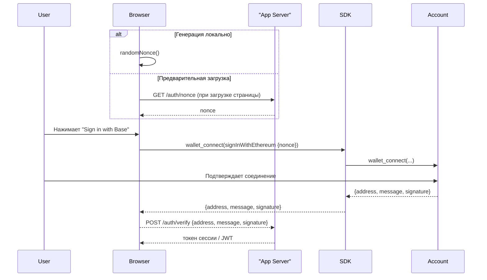

import {BasePayButton} from "/snippets/BasePayButton.mdx"
import {SignInWithBaseButton} from "/snippets/SignInWithBaseButton.mdx"

## Почему подписи кошелька вместо паролей?

1. **Нет новых паролей** – аутентификация происходит с помощью ключа, которым пользователь уже управляет.
2. **Нечего украсть или повторно использовать** – каждый вход представляет собой одноразовую, привязанную к домену подпись, которая никогда не покидает устройство пользователя.
3. **Не зависит от кошелька** – работает с любым EIP-1193 кошельком (браузерное расширение, мобильная deep-link, встроенный провайдер) и следует открытому стандарту ["Sign in with Ethereum" (SIWE) EIP-4361](https://eips.ethereum.org/EIPS/eip-4361).

Base Accounts построены на этих стандартах, поэтому вы можете повторно использовать любой инструментарий SIWE – и при этом пользоваться преимуществами passkeys, сессионных ключей и безопасности смарт-кошельков.

<Warning>
**Пожалуйста, следуйте руководству по бренду** 

Если вы планируете использовать `SignInWithBaseButton`, пожалуйста, следуйте [Brand Guidelines](/base-account/reference/ui-elements/brand-guidelines) чтобы обеспечить единообразие в вашем приложении.

</Warning>

## Общая схема процесса



<Note type="info">
**Не развернутые смарт-кошельки?**  <br/> Подписи Base Account включают обертку <a href="https://eips.ethereum.org/EIPS/eip-6492" target="_blank">ERC-6492</a> поэтому их можно верифицировать даже до развертывания контракта кошелька. Функции `verifyMessage` и `verifyTypedData` в Viem обрабатывают это автоматически.
</Note>

## Реализация 

### Установите зависимости

Убедитесь, что установили зависимости:

<CodeGroup>
```bash
npm install @base-org/account @base-org/account-ui
```

```bash
pnpm add @base-org/account @base-org/account-ui
```

```bash
yarn add @base-org/account @base-org/account-ui
```

```bash
bun add @base-org/account @base-org/account-ui
```

</CodeGroup>

### Примеры кода

<CodeGroup>
```ts Browser (SDK)
import { createBaseAccountSDK } from "@base-org/account";
import crypto from 'crypto';

// Инициализируем SDK
const provider = createBaseAccountSDK({appName: 'My App'}).getProvider();

// 1 — получаем свежий nonce (генерируем локально или предварительно загружаем с бэкенда)
const nonce = window.crypto.randomUUID().replace(/-/g, '');
// ИЛИ предзагружаем с сервера
// const nonce = await fetch('/auth/nonce').then(r => r.text());

// 2 — переключаемся на сеть Base
const switchChainResponse = await provider.request({
        method: "wallet_switchEthereumChain",
        params: [{ chainId: '0x2105' }],
      })

      console.log('Switch chain response:', switchChainResponse);

// 3 — подключаемся и аутентифицируемся
try {
  const { accounts } = await provider.request({
    method: 'wallet_connect',
    params: [{
      version: '1',
      capabilities: {
        signInWithEthereum: { 
          nonce, 
          chainId: '0x2105' // Base Mainnet - 8453
        }
      }
    }]
  });
  const { address } = accounts[0];
  const { message, signature } = accounts[0].capabilities.signInWithEthereum;
  await fetch('/auth/verify', {
    method: 'POST',
    headers: { 'Content-Type': 'application/json' },
    body: JSON.stringify({ address, message, signature })
  });
} catch (err) {
  console.error(`err ${err}`);
}
```
```ts Backend (Viem)
import { createPublicClient, http } from 'viem';
import { base } from 'viem/chains';

const client = createPublicClient({ chain: base, transport: http() });

export async function verifySig(req, res) {
  const { address, message, signature } = req.body;
  const valid = await client.verifyMessage({ address, message, signature });
  if (!valid) return res.status(401).json({ error: 'Invalid signature' });
  // создаем сессию / JWT
  res.json({ ok: true });
}
```
</CodeGroup>

<Note type="tip">
Если используете код выше за пределами Base Account, обратите внимание, что не все кошельки еще поддерживают новый метод [<code>wallet_connect</code> method](/base-account/reference/core/provider-rpc-methods/wallet_connect).  Если вызов выбрасывает ошибку [<code>method_not_supported</code>], вернитесь к использованию <code>eth_requestAccounts</code> и <code>personal_sign</code>.
</Note>

<Note type="tip">
Чтобы избежать [блокировки всплывающих окон](/base-account/more/troubleshooting/usage-details/popups#default-blocking-behavior), получайте или генерируйте nonce <strong>до</strong> того, как пользователь нажмет "Sign in with Base" (например, при загрузке страницы). Для безопасности требуется только, чтобы ваш бэкенд отслеживал каждый nonce и отклонял те, которые используются повторно – независимо от их происхождения.
</Note>

{/* 
TODO: Link Wagmi Sign in with Base guide
<Note>
Полный пример на React смотрите в <a href="/docs/base-account/framework-integrations/react-wagmi">руководстве по React + Wagmi</a>.
</Note> */}

### Пример сервера на Express

```ts title="server/auth.ts"
import crypto from 'crypto';
import express from 'express';
import { createPublicClient, http } from 'viem';
import { base } from 'viem/chains';

const app = express();
app.use(express.json());

// Простое хранилище nonce в памяти (замените на Redis или БД в продакшене)
const nonces = new Set<string>();

app.get('/auth/nonce', (_, res) => {
  const nonce = crypto.randomBytes(16).toString('hex');
  nonces.add(nonce);
  res.send(nonce);
});

const client = createPublicClient({ chain: base, transport: http() });

app.post('/auth/verify', async (req, res) => {
  const { address, message, signature } = req.body;

  // 1. Проверяем, что nonce не использовался повторно
  const nonce = message.match(/at (\w{32})$/)?.[1];
  if (!nonce || !nonces.delete(nonce)) {
    return res.status(400).json({ error: 'Invalid or reused nonce' });
  }

  // 2. Проверяем подпись
  const valid = await client.verifyMessage({ address, message, signature });
  if (!valid) return res.status(401).json({ error: 'Invalid signature' });

  // 3. Создаем сессию / JWT здесь
  res.json({ ok: true });
});

app.listen(3001, () => console.log('Auth server listening on :3001'));
```

## Добавьте кнопку "Sign in with Base"

Используйте готовый компонент для нативного внешнего вида и поведения:

```tsx title="App.tsx"
import { SignInWithBaseButton } from '@base-org/account-ui/react';

export function App() {
  return (
    <SignInWithBaseButton
      colorScheme="light"
      onClick={() => signInWithBase()}
    />
  );
}
```

Полный список пропсов и параметров темизации смотрите в [Button Reference](/base-account/reference/ui-elements/sign-in-with-base-button) и [Brand Guidelines](/base-account/reference/ui-elements/brand-guidelines).

<Warning>
**Пожалуйста, следуйте Brand Guidelines** 

Если вы планируете использовать `SignInWithBaseButton`, пожалуйста, следуйте [Brand Guidelines](/base-account/reference/ui-elements/brand-guidelines) чтобы обеспечить единообразие в вашем приложении.

</Warning>
