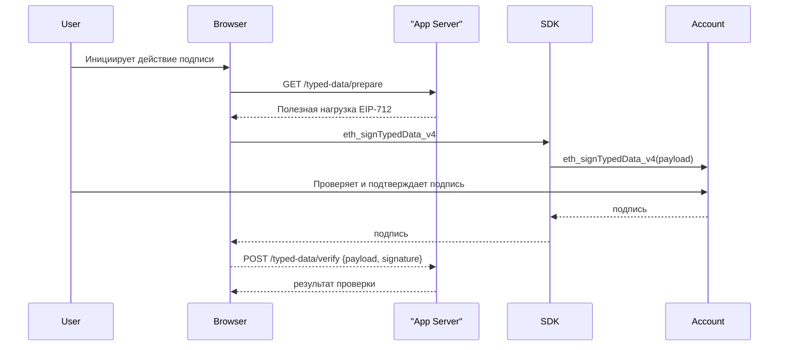

## Обзор

Base Account использует [контракты смарт-кошельков](https://github.com/coinbase/smart-wallet). Смарт-контрактные кошельки имеют некоторые отличия в том, как подписываются сообщения, по сравнению с традиционными аккаунтами, контролируемыми извне (Externally Owned Accounts, EOA). В этом руководстве объясняется, как правильно реализовать подпись сообщений с помощью Base Account, рассматривая как стандартные сообщения, так и подписи типизированных данных, а также некоторые частные случаи.

## Введение

Прежде чем углубляться в детали того, как подписывать и проверять сообщения с помощью Base Account, важно понять некоторые сценарии использования подписей кошелька, а также ключевые различия между EOA и смарт-контрактами в части подписи сообщений.

### Сценарии использования подписей кошелька

Приложения на основе блокчейна используют подписи кошелька для двух основных целей:

1. **Подписи для оффчейн-верификации**: Используются для аутентификации пользователей в ончейн-приложениях (например, Sign-In with Ethereum), чтобы предотвратить спуфинг (подмену). Подпись не используется для каких-либо действий в блокчейне.

2. **Подписи для ончейн-верификации**:Используются для подписи разрешений в блокчейне (например, [Permit2](https://github.com/Uniswap/permit2)) или пакетной обработки транзакций. Подпись обычно хранится для будущих транзакций.

### Отличия смарт-контрактных кошельков

Смарт-контрактные кошельки обрабатывают подписи иначе, чем EOA, несколькими способами:

- Сам контракт не создает подписи - вместо этого сообщения подписывает владелец (например, passkey).
- Проверка происходит через функцию `isValidSignature`, определенную в [EIP-1271](https://eips.ethereum.org/EIPS/eip-1271)
- Адреса смарт-контрактных кошельков часто детерминированы, что позволяет поддерживать подписи еще до развертывания кошелька через [ERC-6492](https://eips.ethereum.org/EIPS/eip-6492)

## Общая схема процесса

В этом руководстве мы рассмотрим общую схему подписи и проверки сообщений с помощью Base Account.



## Реализация

Для целей этого руководства мы используем простой пример полезной нагрузки типизированных данных, 
содержащей разрешение на трату средств пользователя (см. [Spend Permissions](/base-account/improve-ux/spend-permissions))

### Примеры кода

<CodeGroup>
```ts Browser (SDK)
import { createBaseAccountSDK } from "@base-org/account";

// Инициализируем SDK
const provider = createBaseAccountSDK().getProvider();

// 1 — Подготавливаем полезную нагрузку типизированных данных
const typedData = {
  domain: {
    name: 'Spend Permission Manager',
    version: '1',
    chainId: 8453, // or any other supported chain
    verifyingContract: SPEND_PERMISSION_MANAGER_ADDRESS,
  },
  types: {
    SpendPermission: [
      { name: 'account', type: 'address' },
      { name: 'spender', type: 'address' },
      { name: 'token', type: 'address' },
      { name: 'allowance', type: 'uint160' },
      { name: 'period', type: 'uint48' },
      { name: 'start', type: 'uint48' },
      { name: 'end', type: 'uint48' },
      { name: 'salt', type: 'uint256' },
      { name: 'extraData', type: 'bytes' },
    ],
  },
  primaryType: 'SpendPermission',
  message: spendPermissionData,
};

// 2 — Запрашиваем подпись у пользователя
try {
  const accounts = await provider.request({
    method: 'eth_requestAccounts'
  });
  
  const signature = await provider.request({
    method: 'eth_signTypedData_v4',
    params: [accounts[0], JSON.stringify(typedData)]
  });

  // 3 — Отправляем на бэкенд для проверки
  const response = await fetch('/typed-data/verify', {
    method: 'POST',
    headers: { 'Content-Type': 'application/json' },
    body: JSON.stringify({ 
      typedData, 
      signature, 
      address: accounts[0] 
    })
  });
  
  const result = await response.json();
  console.log('Verification result:', result);
} catch (err) {
  console.error('Signing failed:', err);
}
```

```ts Backend (Viem)
import { createPublicClient, http } from 'viem';
import { base } from 'viem/chains';

const client = createPublicClient({ 
  chain: base, 
  transport: http() 
});

export async function verifyTypedData(req, res) {
  const { typedData, signature, address } = req.body;
  
  try {
    // Проверяем подпись типизированных данных
    const valid = await client.verifyTypedData({
      address,
      domain: typedData.domain,
      types: typedData.types,
      primaryType: typedData.primaryType,
      message: typedData.message,
      signature
    });

    if (!valid) {
      return res.status(401).json({ error: 'Invalid signature' });
    }

    // Дополнительная логика проверки здесь
    // e.g., check expiry, nonce, permissions, etc.
    const now = Math.floor(Date.now() / 1000);
    if (typedData.message.expiry < now) {
      return res.status(401).json({ error: 'Signature expired' });
    }

    // Обрабатываем проверенные типизированные данные
    res.json({ 
      valid: true, 
      message: 'Signature verified successfully',
      data: typedData.message 
    });
  } catch (error) {
    console.error('Verification error:', error);
    res.status(500).json({ error: 'Verification failed' });
  }
}
```
</CodeGroup>

## Пример сервера на Express

```ts title="server/typed-data.ts"
import express from 'express';
import { createPublicClient, http } from 'viem';
import { base } from 'viem/chains';

const app = express();
app.use(express.json());

const client = createPublicClient({ 
  chain: base, 
  transport: http() 
});

// Простое хранилище nonce (используйте Redis/БД в продакшене)
const usedNonces = new Set<string>();

app.get('/typed-data/prepare', (req, res) => {
  const { userAddress, action, resource } = req.query;
  
  const nonce = Math.floor(Math.random() * 1000000);
  const expiry = Math.floor(Date.now() / 1000) + 3600; // 1 час
  
  const typedData = {
    // ВАШИ ТИПИЗИРОВАННЫЕ ДАННЫЕ ЗДЕСЬ
  }
  
  res.json(typedData);
});

app.post('/typed-data/verify', async (req, res) => {
  const { typedData, signature, address } = req.body;
  
  try {
    // 1. Проверяем, что nonce не использовался повторно
    const nonceKey = `${address}-${typedData.message.nonce}`;
    if (usedNonces.has(nonceKey)) {
      return res.status(400).json({ error: 'Nonce already used' });
    }
    
    // 2. Проверяем срок действия
    const now = Math.floor(Date.now() / 1000);
    if (typedData.message.expiry < now) {
      return res.status(400).json({ error: 'Signature expired' });
    }
    
    // 3. Проверяем подпись
    const valid = await client.verifyTypedData({
      address,
      domain: typedData.domain,
      types: typedData.types,
      primaryType: typedData.primaryType,
      message: typedData.message,
      signature
    });
    
    if (!valid) {
      return res.status(401).json({ error: 'Invalid signature' });
    }
    
    // 4. Помечаем nonce как использованный
    usedNonces.add(nonceKey);
    
    // 5. Обрабатываем проверенное действие
    res.json({ 
      valid: true,
      message: 'Typed data verified successfully',
      action: typedData.message.action,
      resource: typedData.message.resource
    });
  } catch (error) {
    console.error('Verification error:', error);
    res.status(500).json({ error: 'Verification failed' });
  }
});

app.listen(3001, () => console.log('Typed data server listening on :3001'));
```

## Рекомендуемые практики

### Разделение доменов
Всегда используйте уникальные параметры домена, чтобы предотвратить повторное использование подписи в разных приложениях:

```tsx
const domain = {
  name: 'Your App Name',           // Уникальный идентификатор приложения
  version: '1',                    // Версионируйте ваши типы данных
  chainId: 8453,                   // Определено для конкретной сети
  verifyingContract: contractAddr   // Контракт, который будет выполнять проверку
};
```

### Управление nonce
Включайте nonce, чтобы предотвратить атаки повторного использования:

```tsx
// Генерируем уникальные nonce
const nonce = crypto.randomBytes(16).toString('hex');

// Храните и проверяйте nonce на стороне сервера
const usedNonces = new Set(); // Use Redis/DB in production
```

### Сроки действия
Всегда включайте метки времени истечения срока действия для ограниченных по времени подписей:

```tsx
const expiry = Math.floor(Date.now() / 1000) + 3600; // 1 час
```
