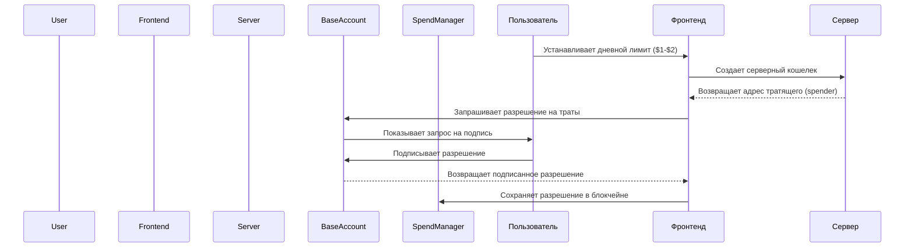
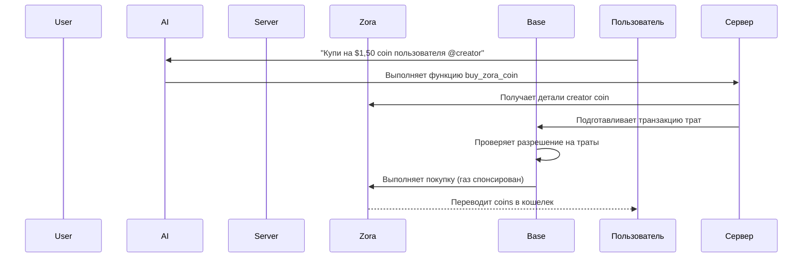

Узнайте, как создать AI агента, который может автономно покупать [Zora Creator Coins](https://docs.zora.co/coins) используя безопасные [Spend Permissions](/base-account/improve-ux/spend-permissions) в Base.
Этот пример демонстрирует, как объединить [Spend Permissions](/base-account/improve-ux/spend-permissions) от Base Account с [Server Wallets](https://docs.cdp.coinbase.com/server-wallets/v2/introduction/quickstart) и [Trade API](https://docs.cdp.coinbase.com/trade-api/quickstart) от Coinbase Developer Platform (CDP) для выполнения бесшовных, бесплатных (gas-free) транзакций AI агентом.

<Frame>
  
</Frame>

## Обзор

Этот пример демонстрирует полную реализацию AI агента, которая:

- **Аутентифицирует пользователей** с помощью Base Account, используя (SIWE)](/base-account/guides/authenticate-users)
- **Управляет разрешениями на траты (Spend Permissions)**, позволяя пользователям устанавливать дневные лимиты с помощью [ Base Account Spend Permissions](/base-account/improve-ux/spend-permissions)
- **Обрабатывает запросы на естественном языке** для покупки Zora creator coins с использованием [OpenAI](https://openai.com/)
- **Выполняет транзакции** автономно с использованием [Server Wallets](https://docs.cdp.coinbase.com/server-wallets/v2/introduction/quickstart) и [Trade API](https://docs.cdp.coinbase.com/trade-api/quickstart) от CDP
- **Спонсирует комиссию за газ (Gas Fees) с использованием [CDP Paymaster](https://docs.cdp.coinbase.com/paymaster/introduction/welcome) для бесшовного UX
- **Получает детали creator coins** с использованием [Zora SDK](https://docs.zora.co/coins/sdk)

<CardGroup cols={2}>
  <Card
    title="Живая демо"
    icon="rocket"
    href="https://base-agent-spend-permissions.vercel.app"
  >
    Попробуйте живое приложение и посмотрите разрешения на траты в действии
  </Card>
  <Card
    title="Исходный код"
    icon="github"
    href="https://github.com/base/demos/tree/master/base-account/agent-spend-permissions"
  >
    Изучите полную реализацию на GitHub
  </Card>
</CardGroup>

<Warning>
  **Безопасность для продакшена**: Этот пример использует упрощенное управление сессиями для демонстрации. В продакшене реализуйте корректные JWT токены с безопасными секретами сессий.
</Warning>

## Ключевые возможности

### 🔐 Безопасная аутентификация

Процесс аутентификации сочетает подключение кошелька на фронтенде с верификацией подписи на бэкенде:

<CodeGroup>
```typescript src/components/SignInWithBase.tsx
// Frontend: Sign-In with Ethereum implementation
const provider = createBaseAccountSDK({
  appName: "Zora Creator Coins Agent",
}).getProvider();

// 1. Получаем nonce с сервера
const nonceResponse = await fetch('/api/auth/verify', { method: 'GET' });
const { nonce } = await nonceResponse.json();

// 2. Подключаемся с поддержкой SIWE
const connectResponse = await provider.request({
  method: "wallet_connect",
  params: [{
    version: "1",
    capabilities: {
      signInWithEthereum: {
        chainId: '0x2105',
        nonce,
      },
    },
  }],
});

// 3. Проверяем подпись на сервере
const verifyResponse = await fetch('/api/auth/verify', {
  method: 'POST',
  headers: { 'Content-Type': 'application/json' },
  body: JSON.stringify({ address, message, signature })
});
```

```typescript src/app/api/auth/verify/route.ts
// Бэкенд: Верификация подписи и управление сессиями
export async function POST(request: NextRequest) {
  const { address, message, signature } = await request.json();

  // Извлекаем и проверяем nonce
  const nonce = message.match(/Nonce: (\w+)/)?.[1];
  if (!nonce || !nonces.has(nonce)) {
    return NextResponse.json({ error: 'Invalid or expired nonce' }, { status: 401 });
  }

  // Удаляем nonce для предотвращения повторного использования
  nonces.delete(nonce);

  // Проверяем подпись с помощью viem
  const isValid = await client.verifyMessage({ 
    address: address as `0x${string}`, 
    message, 
    signature: signature as `0x${string}` 
  });
  
  if (isValid) {
    // Создаем безопасный токен сессии
    const sessionToken = Buffer.from(`${address}:${Date.now()}`).toString('base64');
    
    const response = NextResponse.json({ ok: true, address, sessionToken });
    
    // Устанавливаем безопасную cookie сессии
    response.cookies.set('session', sessionToken, {
      httpOnly: true,
      secure: process.env.NODE_ENV === 'production',
      sameSite: 'strict',
      maxAge: 60 * 60 * 24 * 7 // 1 week
    });
    
    return response;
  }
}

export async function GET() {
  // Генерируем безопасный nonce для запроса аутентификации
  const array = new Uint8Array(16);
  crypto.getRandomValues(array);
  const nonce = Array.from(array, byte => byte.toString(16).padStart(2, '0')).join('');
  
  nonces.add(nonce);
  return NextResponse.json({ nonce });
}
```
</CodeGroup>

### 💸 Управление разрешениями на траты (Spend Permission)

Пользователи могут предоставлять агенту ограниченные права на расходование средств:

<CodeGroup>
```typescript src/components/SpendPermissionSetup.tsx
// Фронтенд: Запрос разрешения на траты у пользователя
import { requestSpendPermission } from "@base-org/account/spend-permission";
import { createBaseAccountSDK } from "@base-org/account";

const handleSetupPermission = async () => {
  // Получаем адрес серверного кошелька
  const walletResponse = await fetch("/api/wallet/create", { method: "POST" });
  const { smartAccountAddress } = await walletResponse.json();

  // Запрашиваем разрешение на траты
  const permission = await requestSpendPermission({
    account: userAddress as `0x${string}`,
    spender: smartAccountAddress as `0x${string}`,
    token: USDC_BASE_ADDRESS as `0x${string}`,
    chainId: 8453,
    allowance: BigInt(dailyLimit * 1_000_000), // Конвертируем USD в USDC (6 decimals)
    periodInDays: 1,
    provider: createBaseAccountSDK({
      appName: "Zora Creator Coins Agent",
    }).getProvider(),
  });

  // Сохраняем разрешение для дальнейшего использования
  localStorage.setItem("spendPermission", JSON.stringify(permission));
};
```

```typescript src/lib/spend-permissions.ts
// Утилита: Константы и вспомогательные функции для разрешений на траты
export const USDC_BASE_ADDRESS = '0x833589fcd6edb6e08f4c7c32d4f71b54bda02913';

export async function getUserSpendPermissions(
  userAccount: string,
  spenderAccount: string
) {
  const permissions = await fetchPermissions({
    account: userAccount as `0x${string}`,
    chainId: 8453,
    spender: spenderAccount as `0x${string}`,
    provider: createBaseAccountSDK({
      appName: "Zora Creator Coins Agent",
    }).getProvider(),
  });

  // Фильтруем разрешения для USDC с учетом регистра
  return permissions.filter(p => 
    p.permission?.token?.toLowerCase() === USDC_BASE_ADDRESS.toLowerCase()
  );
}
```
</CodeGroup>

<Callout type="info">
  Разрешения на траты предоставляются для USDC в сети Base mainnet с дневными лимитами от $1 до $2, что безопасно для тестирования и демонстраций.
</Callout>

### 🤖 Интеграция AI агента

Агент обрабатывает запросы на естественном языке и выполняет транзакции:

<CodeGroup>
```typescript src/lib/openai.ts
// Определение функции AI для покупки
export const ZORA_BUY_FUNCTION = {
  type: 'function' as const,
  function: {
    name: 'buy_zora_coin',
    description: 'Buy a Zora creator coin for a specific user handle and amount',
    parameters: {
      type: 'object',
      properties: {
        zoraHandle: {
          type: 'string',
          description: 'The Zora user handle or identifier to buy coins for',
        },
        amountUSD: {
          type: 'number',
          description: 'The amount in USD to spend on the creator coin',
        },
      },
      required: ['zoraHandle', 'amountUSD'],
    },
  },
};

export async function generateChatResponse(
  messages: ChatMessage[],
  tools: any[] = [ZORA_BUY_FUNCTION]
) {
  const response = await openai.chat.completions.create({
    model: 'gpt-4',
    messages: [
      { role: 'system', content: SYSTEM_PROMPT },
      ...messages,
    ],
    tools,
    tool_choice: 'auto',
    max_completion_tokens: 1000,
  });

  return response;
}
```

```typescript src/components/ChatInterface.tsx
// Фронтенд: Интерфейс чата с AI агентом
const sendMessage = async () => {
  const userMessage: Message = {
    id: Date.now().toString(),
    content: inputValue,
    sender: 'user',
    timestamp: new Date(),
  };

  setMessages(prev => [...prev, userMessage]);
  setInputValue('');
  setIsLoading(true);

  try {
    const response = await fetch('/api/chat', {
      method: 'POST',
      headers: { 'Content-Type': 'application/json' },
      body: JSON.stringify({
        messages: [...messages, userMessage].map(m => ({
          role: m.sender === 'user' ? 'user' : 'assistant',
          content: m.content,
        })),
        userAddress,
      }),
    });

    const data = await response.json();
    
    const agentMessage: Message = {
      id: (Date.now() + 1).toString(),
      content: data.message,
      sender: 'agent',
      timestamp: new Date(),
      toolCall: data.toolCall,
      details: data.details,
    };

    setMessages(prev => [...prev, agentMessage]);
  } catch (error) {
    console.error('Chat error:', error);
  } finally {
    setIsLoading(false);
  }
};
```
</CodeGroup>

### ⛽ Бесплатные транзакции (Gas-Free)

Все транзакции спонсируются с использованием CDP Paymaster:

```typescript src/app/api/zora/buy/route.ts
// Бэкенд: Выполнение транзакций со спонсированием газа
import { prepareSpendCallData } from '@base-org/account/spend-permission';

export async function POST(request: NextRequest) {
  const { zoraHandle, amountUSD, permission } = await request.json();
  
  // Конвертируем USD в USDC (6 decimals)
  const amountUSDC = BigInt(Math.floor(amountUSD * 1_000_000));
  
  // Подготавливаем вызовы для трат с использованием разрешения
  const spendCalls = await prepareSpendCallData(permission, amountUSDC);
  
  // Выполняем со спонсированием газа
  const result = await sendCalls({
    calls: spendCalls,
    capabilities: {
      paymasterService: {
        url: process.env.PAYMASTER_URL,
      },
    },
  });
  
  return NextResponse.json({ 
    success: true, 
    transactionHash: result.hash,
    message: `Successfully purchased ${amountUSD} USDC worth of @${zoraHandle}'s creator coin!`
  });
}
```

## Детали реализации

### Процесс аутентификации

<Steps>
  <Step title="Генерация Nonce">
    Сервер генерирует безопасный nonce для запроса аутентификации
  </Step>
  <Step title="Запрос подписи">
    Пользователь подписывает сообщение SIWE, содержащее nonce, с помощью своего Base Account
  </Step>
  <Step title="Проверка подписи">
    Сервер проверяет подпись и nonce для установления безопасной сессии
  </Step>
  <Step title="Создание сессии">
    Создается аутентифицированная сессия с безопасными cookies
  </Step>
</Steps>

### Процесс работы с разрешениями на траты

<Accordion title="Процесс запроса разрешения">

</Accordion>

### Процесс транзакций AI агента

<Accordion title="Purchase Execution Flow">

</Accordion>

## Структура кода

### Фронтенд компоненты

<CodeGroup>
```typescript src/components/SignInWithBase.tsx
// Аутентификация Base Account с SIWE
import { createBaseAccountSDK } from "@base-org/account";

export const SignInWithBaseButton = ({ onSignIn, colorScheme = "light" }) => {
  const [isLoading, setIsLoading] = useState(false);

  const handleSignIn = async () => {
    setIsLoading(true);
    try {
      const provider = createBaseAccountSDK({
        appName: "Zora Creator Coins Agent",
      }).getProvider();

      // 1. Получаем nonce с сервера
      const nonceResponse = await fetch('/api/auth/verify', { method: 'GET' });
      const { nonce } = await nonceResponse.json();
      
      // 2. Подключаемся с поддержкой SIWE
      const connectResponse = await provider.request({
        method: "wallet_connect",
        params: [{
          version: "1",
          capabilities: {
            signInWithEthereum: {
              chainId: '0x2105',
              nonce,
            },
          },
        }],
      });

      const { address } = connectResponse.accounts[0];

      // 3. Обрабатываем SIWE или используем ручное подписание
      if (connectResponse.signInWithEthereum) {
        const { message, signature } = connectResponse.signInWithEthereum;
        
        await fetch('/api/auth/verify', {
          method: 'POST',
          headers: { 'Content-Type': 'application/json' },
          body: JSON.stringify({ address, message, signature })
        });
      }

      onSignIn(address);
    } catch (err) {
      console.error("Sign in failed:", err);
    } finally {
      setIsLoading(false);
    }
  };
};
```

```typescript src/components/SpendPermissionSetup.tsx
// Интерфейс создания разрешений на траты
import { requestSpendPermission } from "@base-org/account/spend-permission";
import { createBaseAccountSDK } from "@base-org/account";

export function SpendPermissionSetup({ userAddress, onPermissionGranted }) {
  const [dailyLimit, setDailyLimit] = useState(2);
  const [isLoading, setIsLoading] = useState(false);

  const handleSetupPermission = async () => {
    setIsLoading(true);
    try {
      // Получаем адрес серверного кошелька
      const walletResponse = await fetch("/api/wallet/create", { method: "POST" });
      const walletData = await walletResponse.json();
      const spenderAddress = walletData.smartAccountAddress;

      // Запрашиваем разрешение на траты у пользователя
      const permission = await requestSpendPermission({
        account: userAddress as `0x${string}`,
        spender: spenderAddress as `0x${string}`,
        token: USDC_BASE_ADDRESS as `0x${string}`,
        chainId: 8453,
        allowance: BigInt(dailyLimit * 1_000_000),
        periodInDays: 1,
        provider: createBaseAccountSDK({
          appName: "Zora Creator Coins Agent",
        }).getProvider(),
      });

      // Сохраняем разрешение локально
      localStorage.setItem("spendPermission", JSON.stringify(permission));
      onPermissionGranted();
    } catch (error) {
      console.error("Permission setup error:", error);
    } finally {
      setIsLoading(false);
    }
  };
}
```

```typescript src/components/SpendPermissionManager.tsx
// Отображение и управление активными разрешениями
import { getUserSpendPermissions, revokeSpendPermission } from '@/lib/spend-permissions';

export function SpendPermissionManager({ isAuthenticated, userAddress }) {
  const [permissions, setPermissions] = useState<any[]>([]);
  const [isRevoking, setIsRevoking] = useState(false);

  const loadPermissions = async () => {
    if (!userAddress) return;
    
    try {
      // Получаем адрес серверного кошелька
      const walletResponse = await fetch("/api/wallet/create", { method: "POST" });
      const { smartAccountAddress } = await walletResponse.json();

      // Получаем разрешения на траты пользователя
      const userPermissions = await getUserSpendPermissions(userAddress, smartAccountAddress);
      setPermissions(userPermissions);
    } catch (error) {
      console.error('Error loading permissions:', error);
    }
  };

  const handleRevokePermission = async (permission: any) => {
    setIsRevoking(true);
    try {
      const result = await revokeSpendPermission(permission);
      console.log('Permission revoked:', result.id);
      
      // Перезагружаем разрешения
      await loadPermissions();
    } catch (error) {
      console.error('Revoke error:', error);
    } finally {
      setIsRevoking(false);
    }
  };
}
```
</CodeGroup>

### Бэкенд API маршруты

<CodeGroup>
```typescript src/app/api/auth/verify/route.ts
// Конечная точка аутентификации с проверкой подписи
import { NextRequest, NextResponse } from 'next/server';
import { createPublicClient, http } from 'viem';
import { base } from 'viem/chains';

const client = createPublicClient({ chain: base, transport: http() });
const nonces = new Set<string>();

export async function POST(request: NextRequest) {
  const { address, message, signature } = await request.json();
  
  // Извлекаем и проверяем nonce
  const nonce = message.match(/Nonce: (\w+)/)?.[1];
  if (!nonce || !nonces.has(nonce)) {
    return NextResponse.json({ error: 'Invalid or expired nonce' }, { status: 401 });
  }
  
  nonces.delete(nonce); // Предотвращаем повторное использование
  
  // Проверяем подпись с помощью viem
  const isValid = await client.verifyMessage({ 
    address: address as `0x${string}`, 
    message, 
    signature: signature as `0x${string}` 
  });
  
  if (isValid) {
    const sessionToken = Buffer.from(`${address}:${Date.now()}`).toString('base64');
    const response = NextResponse.json({ ok: true, address, sessionToken });
    
    response.cookies.set('session', sessionToken, {
      httpOnly: true,
      secure: process.env.NODE_ENV === 'production',
      sameSite: 'strict',
      maxAge: 60 * 60 * 24 * 7
    });
    
    return response;
  }
}

export async function GET() {
  // Генерируем безопасный nonce
  const array = new Uint8Array(16);
  crypto.getRandomValues(array);
  const nonce = Array.from(array, byte => byte.toString(16).padStart(2, '0')).join('');
  
  nonces.add(nonce);
  return NextResponse.json({ nonce });
}
```

```typescript src/app/api/wallet/create/route.ts
// Создание серверного кошелька с использованием CDP SDK
import { NextRequest, NextResponse } from 'next/server';
import { Wallet } from '@coinbase/coinbase-sdk';

export async function POST() {
  try {
    // Создаем новый серверный кошелек
    const wallet = await Wallet.create();
    
    // Создаем смарт-аккаунт для кошелька
    const smartAccount = await wallet.createSmartAccount();
    
    return NextResponse.json({
      serverWalletAddress: wallet.getDefaultAddress(),
      smartAccountAddress: smartAccount.getAddress(),
    });
  } catch (error) {
    console.error('Wallet creation error:', error);
    return NextResponse.json({ error: 'Failed to create wallet' }, { status: 500 });
  }
}
```

```typescript src/app/api/zora/buy/route.ts
// Выполнение покупки creator coin
import { NextRequest, NextResponse } from 'next/server';
import { prepareSpendCallData } from '@base-org/account/spend-permission';

export async function POST(request: NextRequest) {
  try {
    const { zoraHandle, amountUSD, permission } = await request.json();
    
    // Конвертируем USD в USDC (6 decimals)
    const amountUSDC = BigInt(Math.floor(amountUSD * 1_000_000));
    
    // Подготавливаем вызовы для транзакции трат
    const spendCalls = await prepareSpendCallData(permission, amountUSDC);
    
    // Выполняем со спонсированием CDP Paymaster
    const result = await sendCalls({
      calls: spendCalls,
      capabilities: {
        paymasterService: {
          url: process.env.PAYMASTER_URL,
        },
      },
    });
    
    return NextResponse.json({ 
      success: true, 
      transactionHash: result.hash,
      message: `Successfully purchased ${amountUSD} USDC worth of @${zoraHandle}'s creator coin!`
    });
  } catch (error) {
    console.error('Purchase error:', error);
    return NextResponse.json({ error: 'Purchase failed' }, { status: 500 });
  }
}
```

```typescript src/app/api/chat/route.ts
// Конечная точка обработки AI чата
import { NextRequest, NextResponse } from 'next/server';
import { generateChatResponse } from '@/lib/openai';

export async function POST(request: NextRequest) {
  try {
    const { messages, userAddress } = await request.json();
    
    const response = await generateChatResponse(messages);
    const choice = response.choices[0];
    
    if (choice.message.tool_calls) {
      // Обрабатываем вызов функции (buy_zora_coin)
      const toolCall = choice.message.tool_calls[0];
      const { zoraHandle, amountUSD } = JSON.parse(toolCall.function.arguments);
      
      // Выполняем покупку
      const purchaseResponse = await fetch('/api/zora/buy', {
        method: 'POST',
        headers: { 'Content-Type': 'application/json' },
        body: JSON.stringify({ zoraHandle, amountUSD, userAddress }),
      });
      
      const purchaseData = await purchaseResponse.json();
      
      return NextResponse.json({
        message: purchaseData.message,
        toolCall: true,
        details: purchaseData,
      });
    }
    
    return NextResponse.json({
      message: choice.message.content,
      toolCall: false,
    });
  } catch (error) {
    console.error('Chat processing error:', error);
    return NextResponse.json({ error: 'Chat processing failed' }, { status: 500 });
  }
}
```
</CodeGroup>

## Переменные окружения

Настройте эти переменные окружения для деплоя:

<CodeGroup>
```bash Production
NEXT_PUBLIC_SITE_URL=https://your-app.vercel.app
OPENAI_API_KEY=your_openai_api_key
ZORA_API_KEY=your_zora_api_key
PAYMASTER_URL=https://api.developer.coinbase.com/rpc/v1/base/your_key
SESSION_SECRET=your_secure_random_session_secret
```

```bash Development
NEXT_PUBLIC_SITE_URL=http://localhost:3000
OPENAI_API_KEY=your_openai_api_key
ZORA_API_KEY=your_zora_api_key
PAYMASTER_URL=https://api.developer.coinbase.com/rpc/v1/base/your_key
```
</CodeGroup>

## Деплой

### Использование Vercel CLI

Деплойте напрямую из подпапки проекта:

```bash
cd base-account/agent-spend-permissions
npx vercel --prod
```

### Настройка окружения

1. Добавьте переменные окружения в дашборде [Vercel](https://vercel.com)
2. Установите корневую директорию как `base-account/agent-spend-permissions`
3. Фреймворк должен автоматически определиться как Next.js

<Tip>
  Для деплоя в монорепозитории использование Vercel CLI из подпапки надежнее, чем настройка корневой директории в дашборде.
</Tip>

## Примеры использования

### Базовая покупка Creator Coin

```
Пользователь: "Купи на $1,50 creator coin пользователя @vitalik"
Агент: "Я куплю на $1,50 creator coin пользователя @vitalik для вас..."
       ✅ Покупка завершена! Coins переведены в ваш кошелек.
```

### Управление разрешениями

```
Пользователь: Просматривает активные разрешения в правой панели
      - Дневной лимит: $2.00 USDC • Активно
      - Доступна кнопка [Отозвать]
      
Пользователь: Нажимает "Отозвать" → Всплывающее окно кошелька → Разрешение отозвано
Агент: "✅ Разрешение на траты успешно отозвано!"
```

## Связанная документация

<CardGroup cols={2}>
  <Card
    title="Руководство по Spend Permissions"
    icon="shield-check"
    href="/base-account/improve-ux/spend-permissions"
  >
    Узнайте больше о разрешениях на траты (Spend Permissions) в Base Account
  </Card>
  <Card
    title="Спонсирование газа"
    icon="gas-pump"
    href="/base-account/improve-ux/sponsor-gas/paymasters"
  >
    Реализуйте бесплатные транзакции с CDP Paymaster
  </Card>
  <Card
    title="Справка по Base Account SDK"
    icon="wallet"
    href="/base-account/reference/core/createBaseAccount"
  >
    Полная справочная информация по Base Account SDK
  </Card>
  <Card
    title="Справка по CDP"
    icon="cube"
    href="https://docs.cdp.coinbase.com/api-reference/v2/introduction"
  >
    Полная справочная информация по API Coinbase Developer Platform
  </Card>
</CardGroup>

## Следующие шаги

<Steps>
  <Step title="Клонируйте репозиторий">
    ```bash
    git clone https://github.com/base/demos.git
    cd demos/base-account/agent-spend-permissions
    ```
  </Step>
  <Step title="Установите зависимости">
    ```bash
    npm install
    ```
  </Step>
  <Step title="Настройте окружение">
    Настройте ваши переменные окружения для сервисов OpenAI, Zora и CDP
  </Step>
  <Step title="Запустите сервер для разработки">
    ```bash
    npm run dev
    ```
  </Step>
  <Step title="Протестируйте процесс">
    Войдите в систему, настройте разрешения на траты и общайтесь с AI агентом
  </Step>
</Steps>

<Tip>
  **Хотите кастомизировать?** Вы можете изменять промты для AI, лимиты трат, поддерживаемые токены или интегрироваться с другими платформами для создателей, обновляя соответствующие компоненты и API маршруты.
</Tip>
