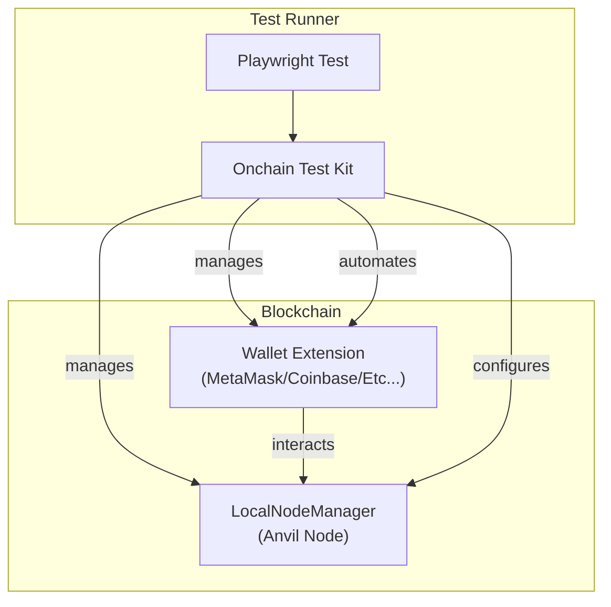
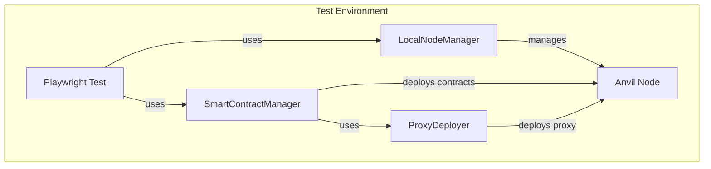

Создание надежных ончейн-приложений требует комплексного тестирования. OnchainTestKit - это типобезопасный фреймворк, разработанный специально для тестирования блокчейн-приложений, построенных на OnchainKit, обеспечивающий плавную интеграцию с Playwright для автоматизации браузера и взаимодействия с кошельками.

## Что такое OnchainTestKit?

[OnchainTestKit](https://github.com/coinbase/onchaintestkit) - это фреймворк для сквозного (end-to-end) тестирования, который автоматизирует:

- Подключения кошельков (MetaMask, Coinbase Wallet)
- Потоки транзакций и их подтверждение
- Переключение сетей
- Взаимодействие со смарт-контрактами
- Обмен (swap) и создание (minting) токенов
- Тестирование спонсирования комиссий (gas sponsorship)

## Зачем использовать OnchainTestKit?

Ручное тестирование блокчейн-приложений занимает много времени и подвержено ошибкам. OnchainTestKit предоставляет:

- **Типобезопасность**: Полная поддержка TypeScript с проверкой ошибок на этапе компиляции
- **Автоматизация кошельков**: Программное управление взаимодействием с кошельками
- **Параллельное тестирование**: Запускайте несколько тестов одновременно в изолированных окружениях
- **Управление сетями**: Встроенная поддержка локальных нод Anvil и тестирования на форках
- **Интеграция с OnchainKit**: Разработан для плавной работы с компонентами OnchainKit

## Хотите узнать больше?

Ознакомьтесь с [полной документацией](https://onchaintestkit.xyz/) для получения подробных руководств по установке, настройке и написанию тестов!

## Архитектура

<Frame>

</Frame>

<Frame>

</Frame>

## Ключевые функции

<AccordionGroup>
<Accordion title="Интеграция с Playwright">
  Автоматизируйте взаимодействие с кошельками и dApp в браузере с помощью мощного фреймворка тестирования Playwright.
</Accordion>

<Accordion title="Поддержка нескольких кошельков">
  Встроенная поддержка MetaMask и Coinbase Wallet, с расширяемой архитектурой для добавления новых кошельков.
</Accordion>

<Accordion title="Обработка смарт-действий">
  Автоматизируйте процессы подключения, транзакций, подписей, подтверждений и переключения сетей с помощью простых API.
</Accordion>

<Accordion title="Управление сетями">
  Используйте локальные ноды Anvil или удаленные RPC-эндпоинты с динамическим выделением портов для параллельного выполнения тестов.
</Accordion>

<Accordion title="Типобезопасность">
  Полная поддержка TypeScript для всех конфигураций и тестовых API, что позволяет выявлять ошибки на этапе компиляции.
</Accordion>

<Accordion title="Удобная конфигурация">
  Паттерн Builder для интуитивной настройки кошельков и нод, делая конфигурацию читаемой и поддерживаемой.
</Accordion>
</AccordionGroup>

## Следующие шаги

- Установите OnchainTestKit: `yarn add -D @coinbase/onchaintestkit`
- Ознакомьтесь с [репозиторием OnchainTestKit](https://github.com/coinbase/onchaintestkit)
- Посмотрите [примеры тестов](https://github.com/coinbase/onchaintestkit/tree/master/example/frontend/e2e)
- Прочитайте [примеры Cookbook](/cookbook/testing-onchain-apps) для дополнительных сценариев тестирования
- Получите доступ к [полной документации здесь](https://onchaintestkit.xyz/)
